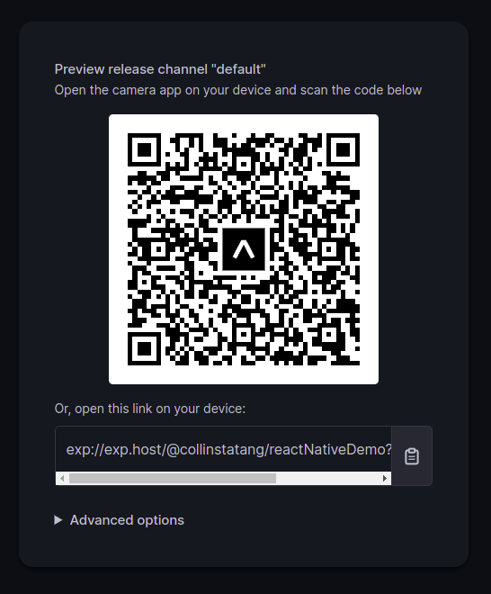

# Soora 


## Learning objective
- Understand the concept of React Native.
- Use Compounent and Style in React Native.
  
### Project requirements
- For this exercise, I replicate our homepage but in React Native.
  
========
## Live Demo
- To run the live demo project please follow below steps
  - Install `expo` on your andriod device 
  - Run the expo app and scan the barcode below. 
  


## Built With

- React Native
  
## Getting Started

To get a local copy up and running follow these simple example steps.

### Prerequisites

- React Native

### Setup

```bash
git clone https://github.com/CollinsTatang/soora.git
cd ./soora
```

### Install

```bash
 install expo
```

### Usage

```bash
expo start
```

### Run tests

```bash
npm test
```

## Authors

👤**Makungong Collins Tatang**

- GitHub: [@CollinsTatang1](https://github.com/CollinsTatang)
- Twitter: [@CollinsTatang1](https://twitter.com/CollinsTatang1)
- LinkedIn: [Makungong Collins](https://www.linkedin.com/in/makungong-collins/)

## 🤝 Contributing

Contributions, issues, and feature requests are welcome!

Feel free to check the [issues page](../../issues/).

## Show your support

Give a ⭐️ if you like this project!

## Acknowledgments

- Soora
- [Soora design team]( https://www.figma.com/file/AvPEne1u5pBHzZYU0lM2WN/Soora-Website?node-id=1%3A87)

## 📝 License

This project is [MIT](./LICENSE) licensed.
